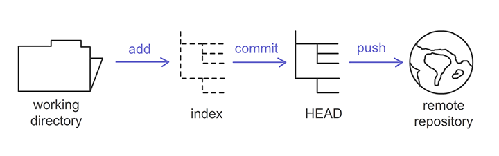
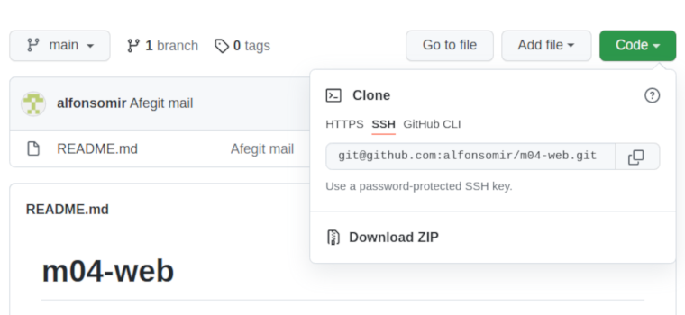
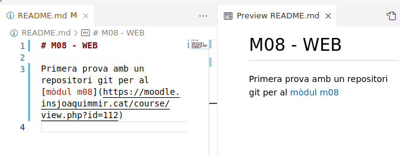

# Primeres passes amb GIT

---

## Git

Git és un programari de control de versions distribuït que permet que diverses persones treballin en paral·lel i desa un historial de tots els canvis realitzats. Això ajudarà a garantir que no hi hagi conflictes de codi i permetrà als desenvolupadors la possibilitat de desfer canvis en fitxers o projectes sencers y recuperar una versió anterior del seu codi.

Git pot fer un seguiment de quins canvis s'han fet, qui ha fet el canvi, quan ha fet el canvi i per què ha fet el canvi.

---

## Instal·lar Git

Comprova que tens `git` instal·lat al teu equip:

```bash
git --version
```

En cas de que no sigui així, segueix la guia següent per a instalar-ho al teu equip: http://git-scm.com/book/es/v2/Inicio---Sobre-el-Control-de-Versiones-Instalaci%C3%B3n-de-Git

---

## Repositori local

El teu repositori local està compost per tres __arbres__ administrats per git. El primer és el teu **Directori de Treball** que conté els fitxers, el segon és l'**Index** que actua com una zona intermèdia, i el darrer és el **Head** que apunta a l'últim _commit_ realitzat.


---

## Repositori remot

Podem crear un repositori remot i sincronitzar-lo amb el vostre repositori local. D'aquesta manera, podem enviar els canvis a una ubicació central on altres persones puguin accedir al vostre codi i també poden ajudar-hi.



Hi ha diversos llocs web per allotjar projectes Git. Farem servir el més popular de tots: **github**

---

## Usuari a github i primer repository

Crea un usuari a github: https://github.com/signup

Indica que ets un estudiant, que ets sol al teu equip  i que vols el pla gratuït (free)

Desprès crea un **repository** amb el nom `m08-web` i fes-ho privat. Afegeix un `README` al crear-lo.

---

## Autenticació amb SSH keys

Una clau SSH és una manera d'identificar-se que no requereix que introduïu el vostre nom d'usuari i contrasenya cada vegada.

Les claus SSH es presenten per parelles, una clau pública que es comparteix amb serveis com GitHub i una clau privada que només s'emmagatzema a l'ordinador. Si les claus encaixen, se't concedeix accés.

La criptografia que hi ha darrere de les claus SSH _garanteix_ que ningú pugui obtenir la vostra clau privada a partir de la cla pública.

Segueix la guía següent i afegeix una clau SSH al teu usuari de github: https://jdblischak.github.io/2014-09-18-chicago/novice/git/05-sshkeys.html

---

## Configuració inicial

Sí és la 1a vegada que fas servir git al teu equip, cap afegir el teu nom i email per a que els teus canvis al repositori quedin registrats al teu nom:

```bash
git config --global user.name "El teu nom"
git config --global user.email "la.teva@adreça.d'email"
```

Desprès, crea una carpeta on hi seran els teus repositoris git per exemple a la teva carpeta `Documents`:

```bash
mkdir ~/Documents/repositoris
```

---

## Adreça per clonar el repository

Amb la teva clau ssh pública registrada a github, és el moment de descarregar el repositori remot `m08-web`. Ho faràs amb l'oció `clone` de git.

Copia l'adreça del teu repository:



---

## Clona el repository

A la teva carpeta `repostitoris` executa la comanda:

```bash
cd ~/Documents/repositoris
git clone git@github.com:alfonsomir/m08-web.git
```

Aquesta comanda crearà una carpeta anomenada `m08-web`, que contindrà una còpia local del teu repository conectada amb el repository remot. Aquesta comanda, en condicions normals, no caldrà que la tornis a executar.

---

## Modifica un fitxer

Si entres a la carpeta `m08-web` hi veuràs el fitxer `README.md` que forma part del repository `m08-web` que has creat a la web de github.

Modifica el fitxer `README.md` afegint una petita descripció. El fitxer és de text pla i pots fer servir [markdown](https://markdown.es/sintaxis-markdown/) per donar-li una bona aparença.



Salva els canvis i torna a la consola.

---

## Afegeix a l'index

Comprova en quin estat està el teu repository local:

```bash
git status
```

Mostra que el fitxer `README.md` no està indexat encara (li diu _untracked_). Afegeix-lo a l'index:

```bash
git add README.md
```

I si tornes a fer `git status` veuràs que te'l mostra en verd.

---

## Commit dels canvis

Ara fes `commit` dels canvis incloent un missatge indicant el motiu dels canvis:

```bash
git commit -m "Actualització dels canvis"
```

En un entorn col·laboratiu, escriure un bon missatge és més important del que pot semblar. [En aquest article pots trobar més informació de com escriure un bon missatge](https://www.freecodecamp.org/espanol/news/como-escribir-un-buen-mensaje-de-commit/).

Si tan sols executes `git commit`, s'obrirà el teu editor per defecte per a que escriguis el missatge.

Si afegeixes el paràmetre `-a` fas a la vegada les commandes `add` i `commit`, afegint automaticament tots els fitxers modificats del teu directori de treball.

---

## Pujar els canvis al servidor

Ara puja els canvis al servidor amb la comanda:

```bash
git push
```

Si ara tornes a fer `git status` et dirà que tot està sicronitzat amb el repositori remot.

Un cop finalitzi, comprova accedint a la web de github que el teu fitxer `Readme.md` té els canvis que has fet.

---

## Baixar canvis

Si alguna altre persona fa canvis al teu repository, o tu mateix fas canvis des de casa, o fins i tot si fas un canvi fent servir la web de github, i ara vols seguir treballant amb el teu codi a l'institut, has de baixar-te els canvis amb la comanda `pull`:

```bash
git pull
```

Per a evitar conflictes, es recomenable fer un `pull` abans de començar a treballar en el teu repository local. No fer-ho pot implicr haver de fer `merge` (**combinar**) els canvis del repositori remot i els teus canvis locals. 

---

## Més git

L'exemple que has fet és amb un escenari on treballes tu tot sol, però git està pensat i preparat per a recuperar versions anteriors d'un projecte, treballar de manera col·lavorativa, amb divereses branques de desenvolupament en paral·lel, etc.

Consulta els enllaços segïuents per a saber-ne més de git:

* https://rogerdudler.github.io/git-guide/index.es.html
* https://www.diegocmartin.com/tutorial-git/
* http://git-scm.com/book/es/v2
